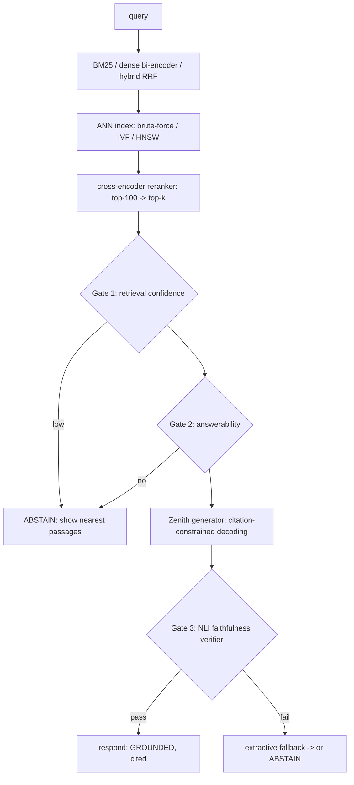

# Meridian

[](https://github.com/cattolatte/meridian/actions/workflows/ci.yml)
[](https://github.com/cattolatte/meridian/releases)
[](https://github.com/cattolatte/meridian)
[](LICENSE)
[](https://mypy-lang.org/)
[](https://github.com/psf/black)
[](https://github.com/astral-sh/ruff)

> A from-scratch grounded RAG engine over biomedical literature (PubMed).
> Every ML component is trained in-house — tokenizer, dense retriever, reranker,
> faithfulness verifier ([Polaris](https://github.com/cattolatte/Polaris)), and the
> cited-answer generator ([Zenith](https://github.com/cattolatte/zenith-nlp-framework)).
> **Every answer is cited, verified, or refused.**

**Research literature assistant. Not medical advice.**

## Status

Built in strictly ordered vertical slices; `meridian ask` answers end-to-end from
`v0.1.0`. Every ML component (tokenizer, dense retriever, IVF/HNSW index, reranker,
grounded generator, NLI verifier, answerability gate) is **implemented and trained by a
committed, seeded pipeline**, verified offline on a tiny sample. The **real quality
numbers require the PubMed/PubMedQA/MS MARCO downloads and MPS/CUDA training runs** — a
deliberate, networked step the user runs; until then benchmark cells read `TBD` (numbers
are never written from memory). See [BENCHMARKS.md](benchmarks/BENCHMARKS.md).

## Architecture (online path)



Every ML box is a from-scratch model: encoders/reranker/verifier are
[Polaris](https://github.com/cattolatte/Polaris); the generator is
[Zenith](https://github.com/cattolatte/zenith-nlp-framework); BM25, the ANN indexes,
serving, and the eval harness are built in this repo on PyTorch/NumPy primitives.

## Design principles

- **Zero external NLP-model dependencies.** No Hugging Face models, no embedding
  APIs, no FAISS or vector DBs. Encoders come from `polaris-nlp`, generation from
  `zenith-nlp` (both pinned); everything else — BM25, IVF/HNSW ANN indexes,
  serving — is built in this repo on PyTorch/NumPy primitives.
- **Baselines before models.** BM25 and brute-force search exist before any neural
  component, so every neural claim has an honest denominator.
- **Grounded or silent.** Generation is citation-constrained, every claim sentence
  is verified by an NLI entailment check, and the system abstains when retrieval
  confidence or answerability is low.
- **The eval harness is the product.** Every published number is reproducible from
  a committed, seeded script. See [benchmarks/BENCHMARKS.md](benchmarks/BENCHMARKS.md).

## Quickstart (offline demo)

The repository ships a tiny synthetic corpus so the vertical slice runs with no
downloads:

```bash
uv sync
uv run meridian ingest examples/sample_pubmed.xml --db build/corpus.sqlite
uv run meridian ask "Does metformin reduce cardiovascular mortality in type 2 diabetes?" \
    --db build/corpus.sqlite
```

You get cited sentences quoted verbatim from the corpus, a `GROUNDED` badge, and the
"Not medical advice" banner — or an `ABSTAIN` when nothing relevant is retrieved. On
the real corpus, replace the sample file with downloaded PubMed baseline files. (The
sample is fabricated data for demonstration only.)

## Repository layout

```
src/meridian/   library code
tests/          offline-only test suite (coverage gate ≥ 90%)
docs/adr/       Architecture Decision Records
docs/design/    per-phase design docs
benchmarks/     benchmark results + reproduction scripts
scripts/        operational scripts (ingest, index builds, releases)
```

## Development

Requires Python ≥ 3.12 and [uv](https://docs.astral.sh/uv/).

```bash
uv sync --extra dev
uv run pre-commit install
uv run pytest
```

Quality gates (enforced in CI and pre-commit): Black, Ruff, `mypy --strict`,
pytest with ≥ 90% coverage. Tests never touch the network.

## Serving

```bash
uv sync --extra serving
uv run python scripts/serve.py --db build/corpus.sqlite   # FastAPI on :8000
# or the whole demo stack (API + static UI):
docker compose up
```

`/ask` returns a cited answer (or abstains), `/passages` the retrieved passages,
`/ask/stream` the same over SSE, `/metrics` per-stage latency. The zero-framework demo
UI (`demo/index.html`) shows the answer, clickable PubMed citations, a GROUNDED/ABSTAIN
badge, and the "not medical advice" banner.

## Guardrails — what this is *not*

Mirrors the discipline of Polaris/Zenith; these are house rules, not marketing.

- **Not medical advice.** A research-literature assistant. Answers are restricted to what
  retrieved literature states, with citations; personal-advice/off-domain questions abstain.
- **Production-*inspired*, never "production-grade."** Laptop-scale corpus and small
  models (encoders ~10–30M, generator ~30–125M). The design compensates with grounding,
  extractive fallback, and abstention — the generator's quality is *additive, not
  load-bearing*.
- **No number without a script.** A metric appears in the README/BENCHMARKS only if a
  committed, seeded script reproduces it, with its MLflow run id. TBD cells stay TBD until
  the real run — never estimated in prose.
- **Not a vector-DB wrapper.** The ANN index (brute-force → IVF → HNSW) is implemented and
  benchmarked here against its own brute-force ground truth. Zero external NLP-model or
  vector-DB dependencies.

See [MODEL_CARD.md](MODEL_CARD.md) for scope, intended use, and limitations.

## License

[MIT](LICENSE). Corpus and benchmark data carry their own terms — see
[docs/license-review.md](docs/license-review.md).
